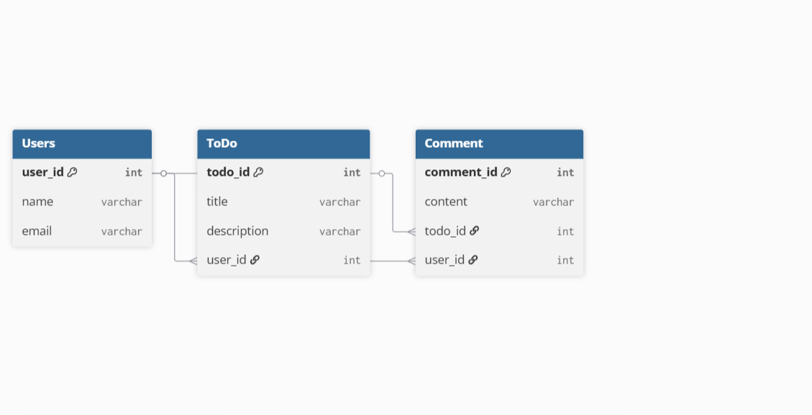

# ERD Diagram Assignment

## Ì≥ò Overview
This project demonstrates a simple SQL database with three related tables:
- **Users**
- **ToDo**
- **Comment**

Each table includes proper foreign key relationships.  
The ERD diagram below visualizes the schema.

## Ì∑© Entity Relationship Diagram

## Ì∑ÑÔ∏è SQL Script
See **ChartDB.sql** for the full database creation and data insertion script.

---

Created by [Educare Hub](https://github.com/Educare-hub)
